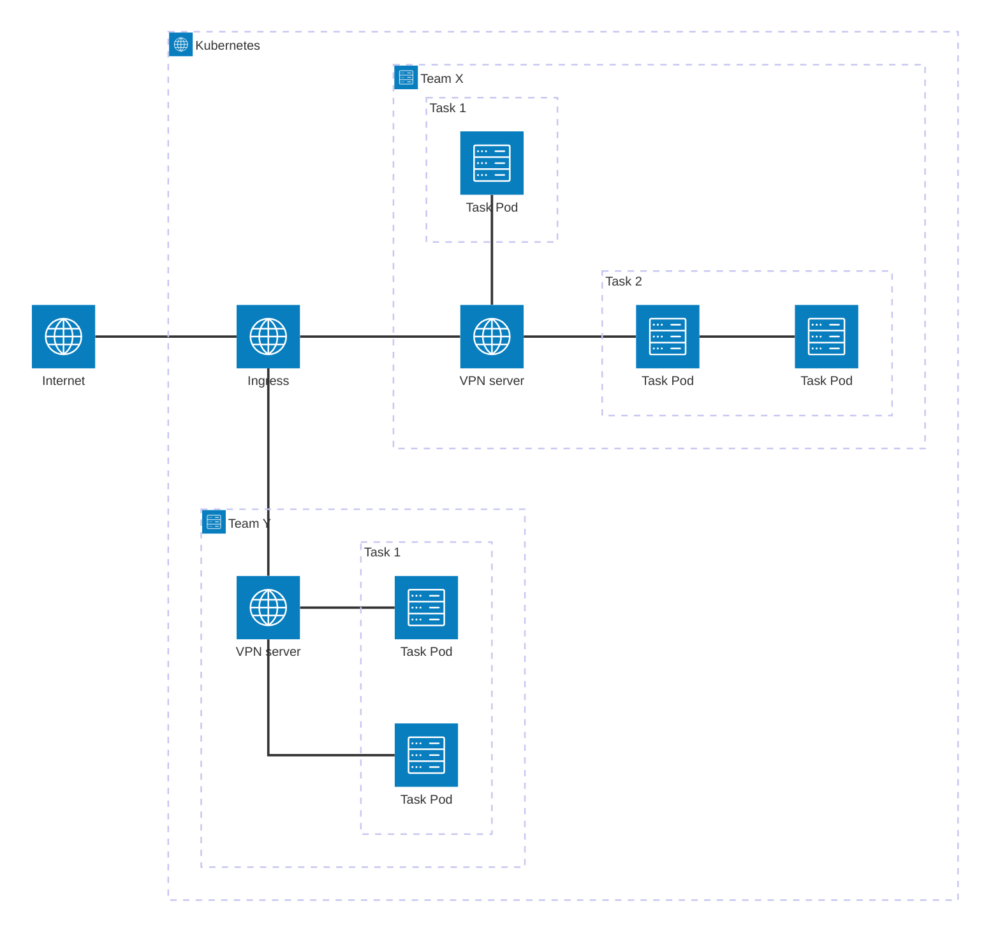

# General Architectural Overview 

Ahaz was created to provide a live containerized task solution via Kubernetes. As such, it has to handle the entire stack from handling requests to start up and shut down tasks, maintaining a registry of configurations for VPN infrastructure and managing the Kubernetes namespaces housing the aformentioned components.

## Kubernetes

At its core, Ahaz attempts to maintain the following Kubernetes structure for every single team namespace:

Effectively, this results in the following VPN configuration for the team:

```mermaid
architecture-beta
    %% outside stuff
    service user1(material-symbols:computer)[User 1]
    service user2(material-symbols:computer)[User 2]


    %% Team Network
    service openvpn(internet)[VPN server]

    user1:R -- L:openvpn
    user2:T -- B:openvpn

    %% VPN

    %% Task 1
    group task_1_1[Task 1]
    service task_pod1_1(server)[Task Pod] in task_1_1
    task_pod1_1:B -- T:openvpn

    %% Task 2
    group task_1_2[Task 2]
    service task_pod1_2(server)[Task Pod] in task_1_2
    service task_pod1_3(server)[Task Pod] in task_1_2

    task_pod1_2:L -- R:openvpn
    task_pod1_3:L -- R:task_pod1_2
    
```

As such, the user simply has to download a single VPN config to be able to connect into the internal lab network, from which they can access all the publicly-facing (t.i. accessible to the VPN server) pods from the tasks they have started up. 

## Ahaz Controller

In order to ensure that the aformentioned setup can be created, the Ahaz Controller has to manage information about the tasks, team VPN configurations (notably, their PKI) and keep track of the statuses of both tasks and the VPN across all teams.

To do so, Ahaz consists of 4 major modules:
- The REST API, allowing other systems (such as the CTF platform) to communicate with it.
- The Kubernetes operator, interfacing with the Kubernetes API to create team namespaces, pods and network policies to ensure connections as defined in spec.
- The certificate manager, generating the necessary PKI for the teams and the users within them for use with the VPN.
- The database operator, interfacing with an SQL database to maintain a ledger of the available tasks that can be launched via Ahaz.

The modules are currently structured into a single Python program, which is interfaced via the REST API. There is a sister project providing a CTFd plugin that is able to provide interface with Ahaz to provide dynamic container tasks in CTFd.

Considering that the Ahaz REST API does not have access control, it is strongly not advised to expose the API to the internet (instead opting for internal networks between the CTF platform and Ahaz).